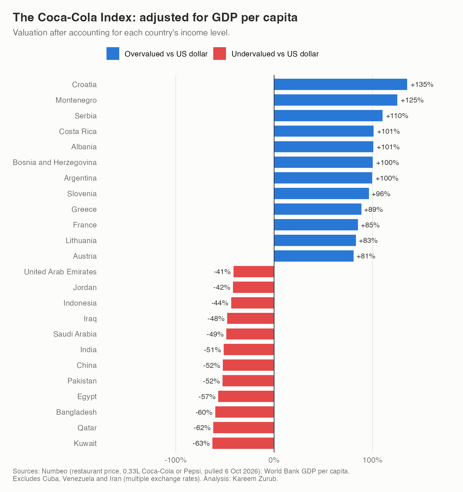

# The Coca-Cola Index

A purchasing power parity (PPP) currency valuation index for 95 countries, built in R on the methodology of The Economist's Big Mac Index, using the price of a Coca-Cola instead of a burger.

**Author:** Kareem Zurub, BA Economics, University of Florida
**Data as of:** 6 October 2026



## Why Coca-Cola

The Big Mac Index works because one company sells one standardized product in many countries. Coca-Cola takes that logic further: it is sold in more than 200 countries, roughly double McDonald's footprint, so it reaches markets the Big Mac misses, including much of Africa, Central Asia and the Middle East.

## Key findings

- **Income explains most of the price gap.** GDP per capita explains 55% of the cross-country variation in what a Coke costs.
- **Raw index:** a Coke costs $2.71 in the US, $5.33 in Switzerland (+97%) and $0.32 in Bangladesh (-88%). 78 of 94 currencies look undervalued against the dollar.
- **Adjusted index:** after controlling for income, the Balkans and Southern Europe look most overvalued (Croatia +135%, Montenegro +125%). The Gulf states look most undervalued (Kuwait -63%, Qatar -62%).
- **Cross-check:** across 46 shared countries, the Coca-Cola Index correlates 0.78 with The Economist's Big Mac Index (raw) and 0.74 (adjusted), and points the same direction for 85% of currencies.

## Methodology

**Raw index.** Prices are collected in US dollars, so each currency's valuation is the ratio of its Coke price to the US price, minus one. This is algebraically identical to comparing the implied PPP exchange rate with the market rate.

```
raw valuation = (local USD price / US USD price) - 1
```

**GDP-adjusted index.** Richer countries have higher wages and rents, which raise the price of anything with a local service component (the Balassa-Samuelson effect). Following The Economist, the dollar price is regressed on GDP per capita, and each country's actual price is compared with the price predicted for its income, relative to the same comparison for the US.

```
price = a + b * GDP per capita
adjusted valuation = (actual / fitted) / (actual_US / fitted_US) - 1
```

## Data

| Input | Source | Notes |
| --- | --- | --- |
| Coke prices | [Numbeo](https://www.numbeo.com/cost-of-living/country_price_rankings?itemId=6) | Restaurant price, 0.33L bottle, last 12 months, in USD |
| GDP per capita | [World Bank](https://data.worldbank.org/indicator/NY.GDP.PCAP.CD) (NY.GDP.PCAP.CD) | Current USD, mostly 2025 |
| Big Mac Index | [The Economist](https://github.com/TheEconomist/big-mac-data) | July 2026 release, CC BY 4.0 |

**Exclusions:** Cuba, Venezuela and Iran, because multiple or parallel exchange rates make the market rate unreliable. Taiwan appears in the raw index only, as the World Bank does not publish its GDP.

## Limitations

- **Coca-Cola or Pepsi.** Numbeo's item covers either brand. Coke leads the category in most markets, but the index is strictly a cola index.
- **Crowdsourced prices.** Numbeo combines user submissions with manually collected data. Coverage and quality vary by country, unlike the company-sourced Big Mac prices.
- **Restaurant prices.** Menus in tourist-heavy countries (Croatia, Montenegro) likely overstate everyday prices.
- **Pegged currencies.** For dollar-pegged currencies (the Gulf states, Jordan), the index measures local price levels more than exchange rate misalignment.
- **US baseline.** The US sits below its fitted price ($2.71 vs $3.31), which lifts every country's adjusted valuation by about 22%.
- **Linear fit.** A log-log specification fits better (R-squared 0.67 vs 0.55). The linear form matches The Economist's method.

## Repository structure

```
coca-cola-index/
├── README.md
├── coca_cola_index.R                    Full analysis
├── data/
│   ├── numbeo_coke_prices.csv           Coke prices by country
│   ├── worldbank_gdp_per_capita.csv     GDP per capita
│   └── economist_bigmac_2026_07.csv     Big Mac Index, July 2026
└── output/
    ├── coca_cola_index_results.csv      Raw and adjusted valuation by country
    ├── coca_cola_vs_bigmac.csv          Side-by-side comparison
    ├── fig1_raw_index.png               Raw index
    ├── fig2_adjusted_index.png          GDP-adjusted index
    ├── fig3_price_vs_gdp.png            Price vs GDP per capita
    └── fig4_coke_vs_bigmac.png          Coca-Cola vs Big Mac
```

## How to run

1. Open `coca_cola_index.R` in RStudio.
2. Set the working directory to this folder (Session > Set Working Directory > To Source File Location).
3. Install the packages once: `install.packages(c("ggplot2", "ggrepel"))`
4. Click **Source** to run the whole script at once. Results and charts are written to `output/`.

## Acknowledgements

Methodology adapted from The Economist's [Big Mac Index](https://github.com/TheEconomist/big-mac-data). Price data from Numbeo contributors.
